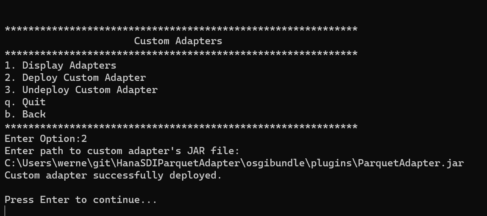
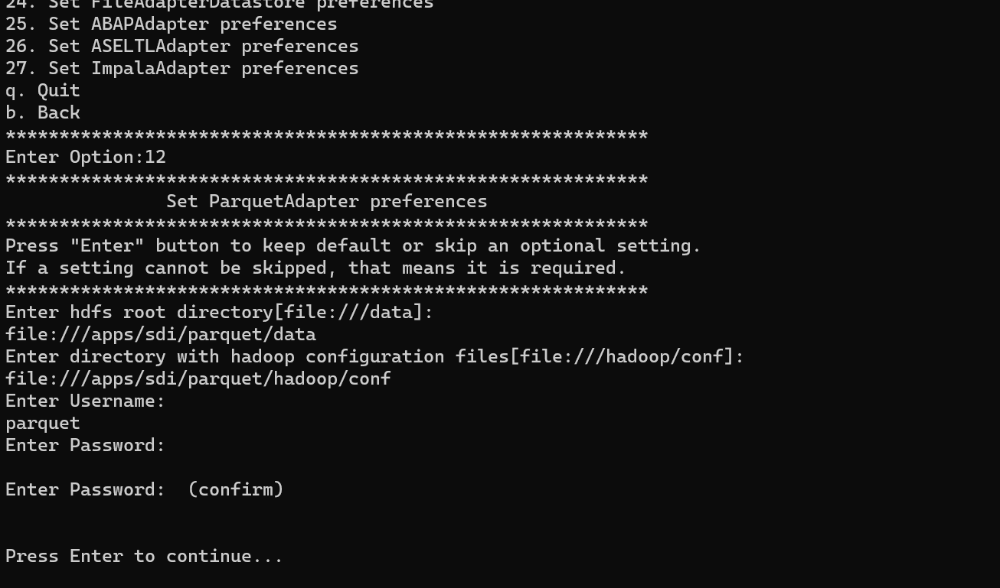
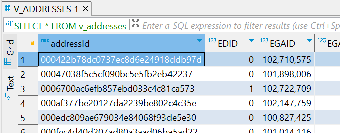
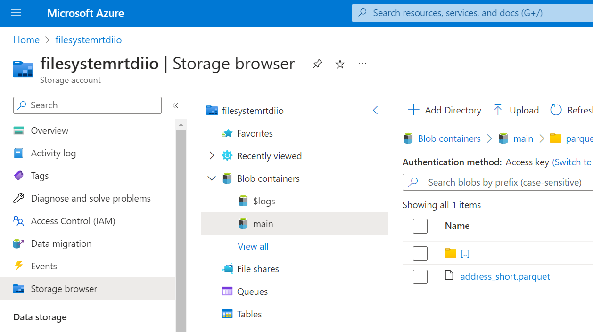
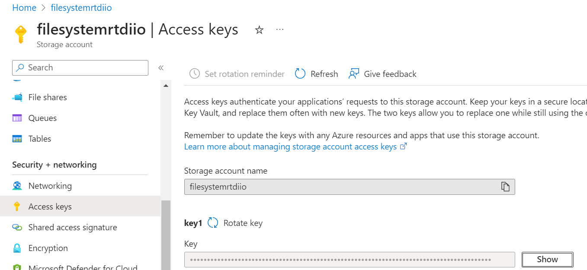

# HanaSDIParquetAdapter

An Adapter for SAP Hana Smart Data Integration to read any Parquet file/directory located anywhere.

The adapter is based on the Hadoop client library, hence can read from local filesystem, HDFS, S3 or any other file system the Hadoop client supports.
For local files, because a Windows installation would require the winutils.dll, the [bare naked filesystem](https://github.com/globalmentor/Hadoop-bare-naked-local-fs) is used instead. This is not an ideal solution as the entire Hadoop client is 60MB in size still. On the other hand, this way not only local files are supported but cloud storage as well.

It supports reading all parquet files and directories containing parquet files, including files with nested structures. In the nested case the data is "joined" by simply selecting the additional columns.

Example 1: A Customer structure with 100 customer entries, each has three addresses
Customer
- FirstName (String)
- LastName (String)
- Address (Array)
  - City (String)
  - Country (String)
  - Type (String)

select FirstName, LastName will return 100 records.
select FirstName, LastName, Address[].City will return 300 records.

Example 2: `CREATE VIRTUAL TABLE v_addresses AT PARQUET_FILES."<NULL>"."<NULL>"."file:/data/addresses";` will read all files contained in that directory recursively.

## Capabilities

- Select: Allows to select the table, no insert, update, delete
- Projection: Skip unneeded columns
- Top n: support select top 100... or select ... limit 100 statements

Filters are not pushed down at the moment.

## Datatypes

It supports the following datatypes Parquet has to offer including LogicalTypes.

 - BsonLogicalTypeAnnotation: ignored
 - IntLogicalTypeAnnotation: Hana INTEGER or BIGINT depending on the backed primitive data type
 - StringLogicalTypeAnnotation: Hana NVARCHAR(1024)
 - MapLogicalTypeAnnotation: ignored
 - EnumLogicalTypeAnnotation: Hana VARCHAR(256)
 - DecimalLogicalTypeAnnotation: Hana DECIMAL(precision, scale)
 - DateLogicalTypeAnnotation: Hana DATE
 - TimeLogicalTypeAnnotation: Hana TIME
 - TimestampLogicalTypeAnnotation: Hana TIMESTAMP
 - JsonLogicalTypeAnnotation: Hana NVARCHAR(4096)
 - UUIDLogicalTypeAnnotation: Hana VARCHAR(64)

If no Logical Type is set, the primitive is used to derive the data type

 - BINARY: Hana BLOB
 - BOOLEAN: Hana BOOLEAN
 - DOUBLE: Hana DOUBLE
 - FIXED_LEN_BYTE_ARRAY: Hana VARBINARY(1024)
 - FLOAT: Hana REAL
 - INT32: Hana INTEGER
 - INT64: Hana BIGINT
 - INT96: Hana TIMESTAMP (Note: deprecated in Parquet, use LogicalTypes instead.)
 

## Adapter installation
 
In the [osgibundle directory](./osgibundle/plugins) is the adapter's jar file with all the required dependencies included.
Copy this file, if required, into any directory, e.g. `/tmp` on the server with the dpagent.

To deploy this adapter, run the `/usr/sap/dataprovagent/bin/agentcli --configAgent` command, connect the tool to Hana and go to Deploy Custom Adapters. The only information required is to the full path of the jar file. The deploy operation copies that file into the `/usr/sap/dataprovagent/adapters/` folder.

Next step is to register the adapter in Hana.
The agentcli has an option for that and executes the command - see [SAP Help](https://help.sap.com/docs/HANA_SMART_DATA_INTEGRATION/7952ef28a6914997abc01745fef1b607/f782efd9a83e44428227835dd6a4d196.html?locale=en-US)

`CREATE ADAPTER "ParquetAdapter" AT LOCATION AGENT "MYAGENT";`

For security reasons the adapter does not allow anybody to read any files on the server. Hence the adapter must be provided with a username/password combination and root directories for the data and the optional Hadoop config file location. This is done via the command `/usr/sap/dataprovagent/bin/agentcli --configAdapters`.

With that the adapter configuration is completed and can be used.

For example, create a new remote source, browse the available tables, create a virtual table for either a specific file or an entire directory and then select from that.

The `rooturl` must be the same or a subdirectory of the directory specified in the configAdapters and the username/password match the provided values also.

    CREATE REMOTE SOURCE PARQUET_FILES ADAPTER "ParquetAdapter"
    AT LOCATION AGENT "MYAGENT" CONFIGURATION
      '<?xml version="1.0" encoding="UTF-8"?>
      <ConnectionProperties name="connectioninfo">
        <PropertyEntry name="rooturl">file:///data</PropertyEntry>
      </ConnectionProperties>'
    WITH CREDENTIAL TYPE 'PASSWORD' USING
      '<CredentialEntry name="credential">
        <user>whatever</user>
        <password>psst</password>
      </CredentialEntry>';

To see all available files, the UIs execute this command, which can be executed manually as well.

    call SYS.GET_REMOTE_SOURCE_OBJECT_TREE ('PARQUET_FILES', '', ?, ?);

Then a first virtual table can be created

    CREATE VIRTUAL TABLE v_addresses AT PARQUET_FILES."<NULL>"."<NULL>"."file:/data/addresses";

and selected from

## Azure

The adapter contains the `Hadoop-azure` and `azure-storage` libraries to connect the Hadoop client to Azure.

In the example below the goal is to read this Parquet file

The approach to switch from the local file system to Azure is to use the `core-site.xml` of Hadoop. The adapter is reading all Hadoop configuration files from the specified directory.
In this example the `/usr/sap/dataprovagent/bin/agentcli --configAdapters` was used to set the Hadoop conf directory to `/apps/sdi/parquet/hadoop/conf`.

In this directory the `core-site.xml` is present with the contents

	<?xml version="1.0"?>
	<configuration>
		<property>         
			<name>fs.AbstractFileSystem.wasb.Impl</name>                           
			<value>org.apache.hadoop.fs.azure.Wasb</value> 
		</property>
		<property>
			<name>fs.azure.account.key.filesystemrtdiio.blob.core.windows.net</name>
			<value>.....azure access key.....</value>
		</property>
		<property>
			<name>fs.defaultFS</name>
			<value>wasbs://main@filesystemrtdiio.blob.core.windows.net</value>
		</property>
	</configuration>

which tells the Hadoop client that there is the Azure file system implementation present, the storage key needed to connect to Azure and switch the default filesystem.

The `filesystemrtdiio` is the storage account name - see above Azure screen shot - and `main` is the storage container and both values are used in the xml.
The Azure access key is found here

The matching remote source is - note the rooturl:

	CREATE REMOTE SOURCE PARQUET_FILES ADAPTER "ParquetAdapter"
	AT LOCATION AGENT "MYAGENT" CONFIGURATION
	  '<?xml version="1.0" encoding="UTF-8"?>
	  <ConnectionProperties name="connectioninfo">
	    <PropertyEntry name="rooturl">wasbs://main@filesystemrtdiio.blob.core.windows.net/parquet</PropertyEntry>
	  </ConnectionProperties>'
	WITH CREDENTIAL TYPE 'PASSWORD' USING
	  '<CredentialEntry name="credential">
        <user>whatever</user>
        <password>psst</password>
	  </CredentialEntry>';

and the virtual table

	CREATE VIRTUAL TABLE v_address_short AT PARQUET_FILES."<NULL>"."<NULL>"."wasbs://main@filesystemrtdiio.blob.core.windows.net/parquet/address_short.parquet";
	

